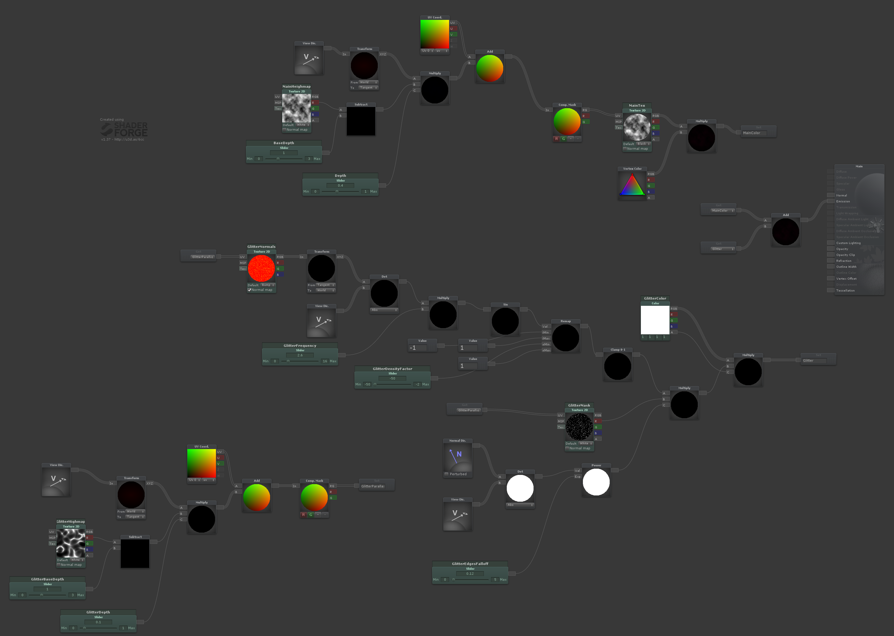

# ParallaxGlitter Shader

Simple parallax shader with a glitter effect (not time but view-direction dependent) in a 2nd parallax layer in an example Unity project

# About

Includes an example scene, background shader and material, parallax glitter material and all needed textures as shown in the example gifs.

Project made using Unity 2018.2.1f1

Included shaders were created using ShaderForge, so if you do have ShaderForge, you can easily look at the node graph to better understand and easily modify as you wish. They are therefore also not optimized for general use, and serve mostly for experimental purposes.

# ShaderForge Node Graph

It is worth noting, that ShaderForge does have a Parallax node to calculate the UV offset. I chose to go with a more explicit form though implementing it separately, mostly for learning purposes (and easier tweaking if needed).
